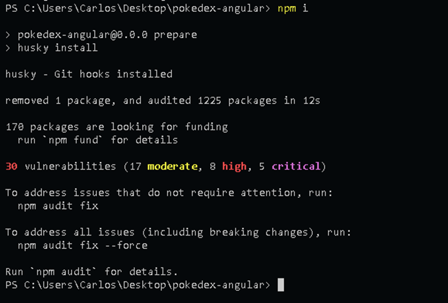
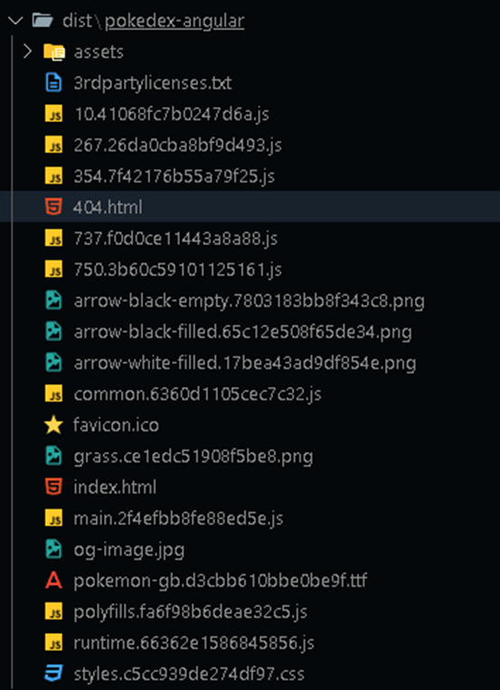
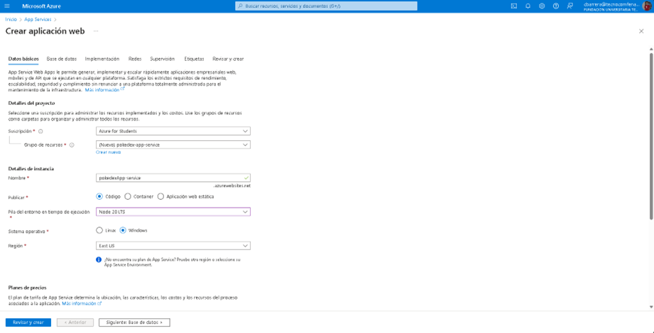
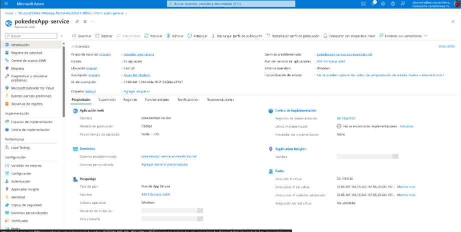
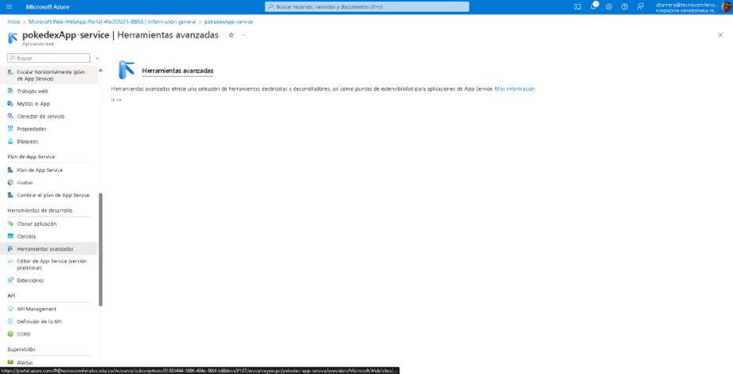
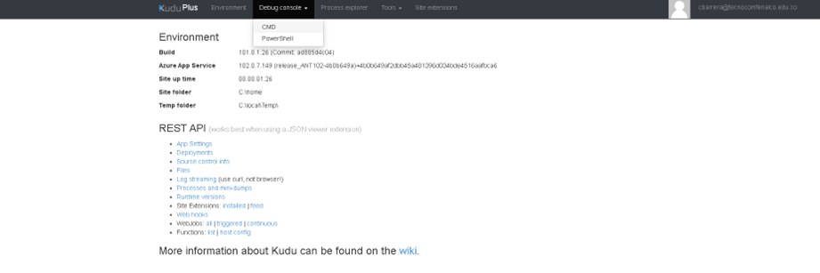
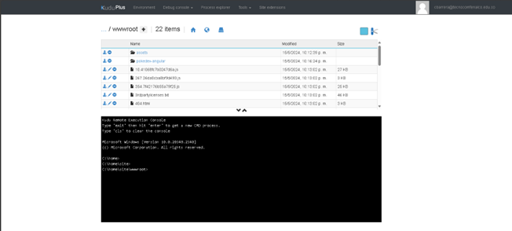
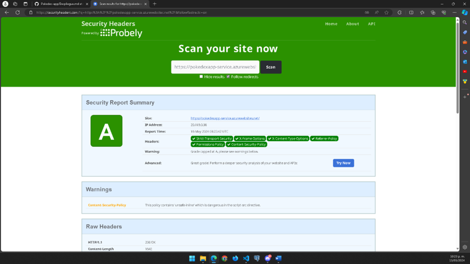

1.	Ejecutamos el comando npm install 
 

2.	Ejecutamos el comando npm run build y esto nos generara una carpeta dist en nuestro proyecto
 

Nos dirigimos al portal de azure

Creamos un grupo de recurso llamado app web service

 

 

Nos dirigimos a herramientas avanzadas

 

Nos dirigimos a Debug console y le damos em cmd

 

Nos dirigimos a la ruta de site/ wroot y añadimos el contenido de la carpeta dist

 
Y accedemos al link que nos genera el portal de azure y este es el resultado 

 

Para gestionar los problemas de seguridad de la aplicación y que también esta cuente con una seguridad hacemos los pasos siguientes: 

 Creamos un archivo web.config con las configuraciones 

 

Accedemos al link https://securityheaders.com/ para verificar la seguridad que tiene nuestro sitio y este es el resultado final

  
